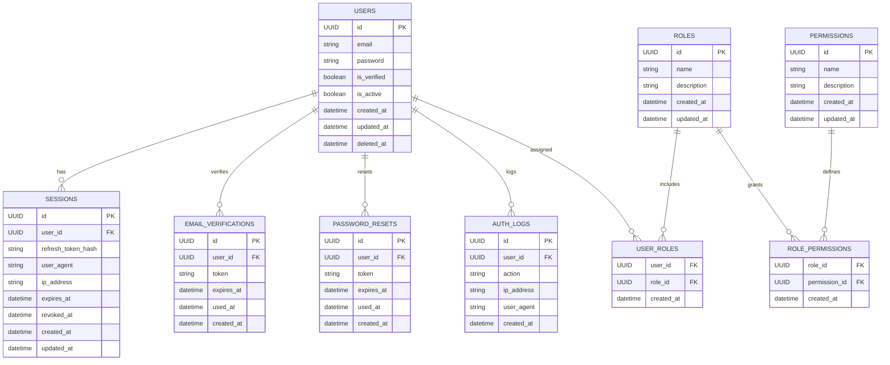

```mermaid
 erDiagram

    USERS {
        UUID id PK
        string email
        string password
        boolean is_verified
        boolean is_active
        datetime created_at
        datetime updated_at
        datetime deleted_at
    }

    SESSIONS {
        UUID id PK
        UUID user_id FK
        string refresh_token_hash
        string user_agent
        string ip_address
        datetime expires_at
        datetime revoked_at
        datetime created_at
        datetime updated_at
    }

    EMAIL_VERIFICATIONS {
        UUID id PK
        UUID user_id FK
        string token
        datetime expires_at
        datetime used_at
        datetime created_at
    }

    PASSWORD_RESETS {
        UUID id PK
        UUID user_id FK
        string token
        datetime expires_at
        datetime used_at
        datetime created_at
    }

    ROLES {
        UUID id PK
        string name
        string description
        datetime created_at
        datetime updated_at
    }

    USER_ROLES {
        UUID user_id FK
        UUID role_id FK
        datetime created_at
    }

    PERMISSIONS {
        UUID id PK
        string name
        string description
        datetime created_at
        datetime updated_at
    }

    ROLE_PERMISSIONS {
        UUID role_id FK
        UUID permission_id FK
        datetime created_at
    }

    AUTH_LOGS {
        UUID id PK
        UUID user_id FK
        string action
        string ip_address
        string user_agent
        datetime created_at
    }

    USERS ||--o{ SESSIONS : has
    USERS ||--o{ EMAIL_VERIFICATIONS : verifies
    USERS ||--o{ PASSWORD_RESETS : resets
    USERS ||--o{ AUTH_LOGS : logs

    USERS ||--o{ USER_ROLES : assigned
    ROLES ||--o{ USER_ROLES : includes

    ROLES ||--o{ ROLE_PERMISSIONS : grants
    PERMISSIONS ||--o{ ROLE_PERMISSIONS : defines

```
